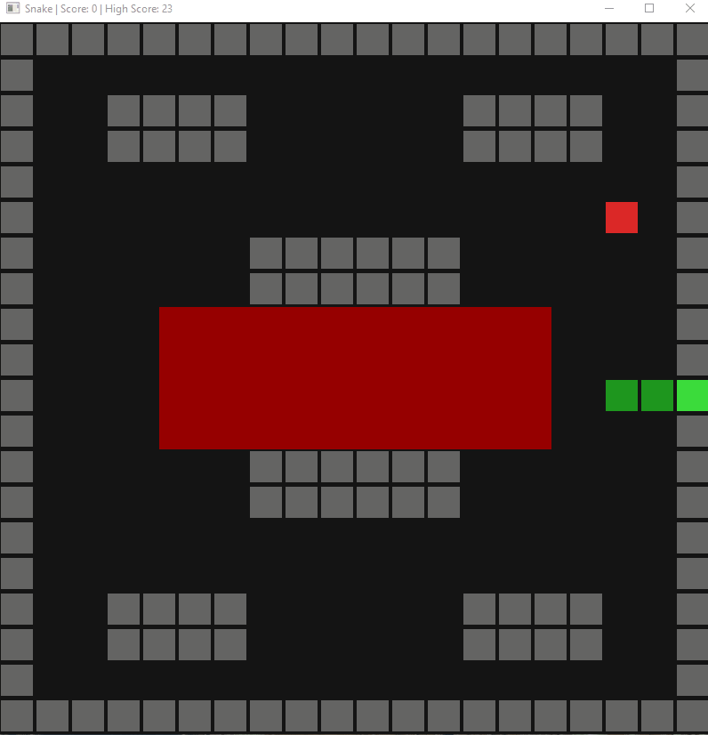

# SnakeLite

Very simple implementation of the game Snake

## Description

The user controls the snake, with the goal being eating as many apples as possible while avoiding hitting either walls or the snake's body for as long as possible.

There are four different maps for the game, each selected at random once the game starts or when the game is reset.

The game ends when the head collides with either a wall or the snake's body.

The best score the player has achieved throughout all runs is saved locally and displayed in the game window.

## Controls

WASD or arrow keys to control the snake, R to restart the game once the current round has been lost.

## Gameplay

## Build & Run

dotnet run

Requires .NET 10 